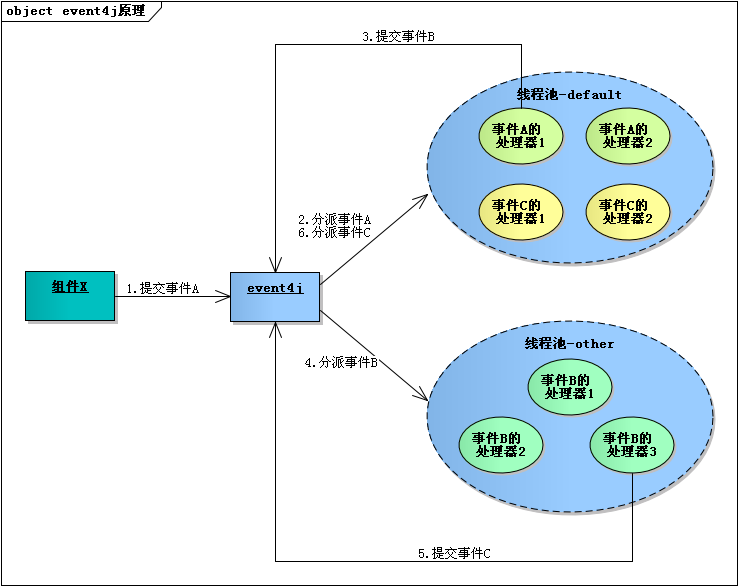

`event4j`是一个实现了`事件驱动`和`异步化`的轻量级框架，可帮助我们实现以事件驱动为中心的应用，采用提交事件和分派事件的方式，使处理事务的上下游各个组件之间不直接发生交互，降低耦合，扩展方便。事件生产者不用关心这个事件有哪些消费者，它只负责向event4j提交事件。事件的消费者也不需关心这个事件是谁产生的，它只需要关注event4j分派事件给它时该如何处理。

event4j以事件对消费者进行分组管理，结构清晰，增加和删除事件的消费者非常方便。内部使用线程池，可以异步化且并行执行事件的处理，使应用的吞吐量大大提升。

简单地讲：event4j只做3件事情：

* 管理事件与消费者的关系。
* 接收提交的事件并分派给需要监听该事件的消费者。
* 提供线程池让事件的消费者异步执行。

# 文档

1、[编译event4j](doc/guide/01-compile.md)。

2、[event4j入门指南](doc/guide/02-guide.md)。

3、[版本历史](doc/guide/03-history.md)。
